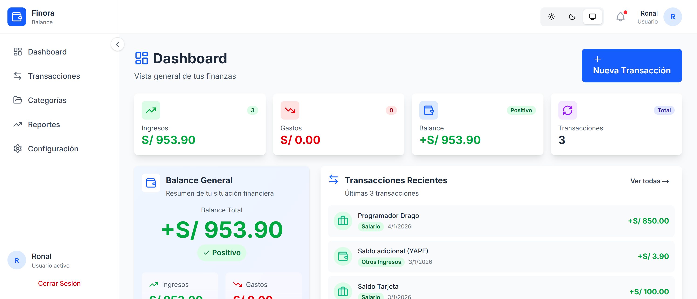

# Finora Balance

**Finora Balance** es una aplicación web de finanzas personales diseñada con un principio claro:

> **Tus datos financieros no deberían salir de tu dispositivo.**

Finora Balance es **offline-first**, no depende de servidores, no usa APIs externas y no requiere backend.  
Toda la lógica y persistencia viven en el frontend, directamente en el navegador.

---

## 🚀 Características principales

- 📊 Gestión de ingresos y gastos
- 🗂️ Categorías personalizadas
- 📈 Dashboard financiero claro y visual
- 💾 Base de datos **SQLite real ejecutándose en el navegador**
- 🔌 Funciona completamente **offline**
- 🔐 Privacidad por diseño (sin nube, sin tracking)
- 📤 Exportación e importación de datos
- 🌙 UI moderna con soporte para modo oscuro

---

## 📸 Capturas de pantalla




---

## 🧠 Filosofía del proyecto

Finora Balance nace como una evolución natural al uso de **Excel** para finanzas personales.

Excel es potente, pero:
- No fue diseñado para análisis financiero diario
- No ofrece una experiencia visual clara
- No escala bien para análisis y reportes
- No prioriza privacidad ni experiencia de usuario

Finora Balance busca resolver eso usando tecnologías web modernas, manteniendo el control total de los datos en manos del usuario.

---

## 🛠️ Stack tecnológico

### Frontend
- **Next.js** (App Router)
- **React 18**
- **TypeScript**
- **TailwindCSS**

### Persistencia de datos
- **SQLite ejecutándose en el navegador vía WebAssembly**
  - `sql.js` o `sqlite-wasm`
- Persistencia del archivo `.sqlite` usando **IndexedDB**

### Estado y lógica
- Zustand / React Context
- Hooks personalizados
- Patrón repository en frontend

---

## 🧱 Arquitectura

- 100% Frontend
- Offline-first
- Sin backend
- Sin API routes
- Separación por capas:
  - UI
  - Dominio
  - Infraestructura (SQLite WASM)

```text
src/
├── app/              # Rutas (Next.js App Router)
├── components/       # Componentes UI reutilizables
├── db/               # Inicialización SQLite (WASM)
├── repositories/     # Acceso a datos (SQL)
├── hooks/            # Hooks personalizados
├── stores/           # Estado global
├── utils/            # Utilidades
└── styles/           # Estilos globales
